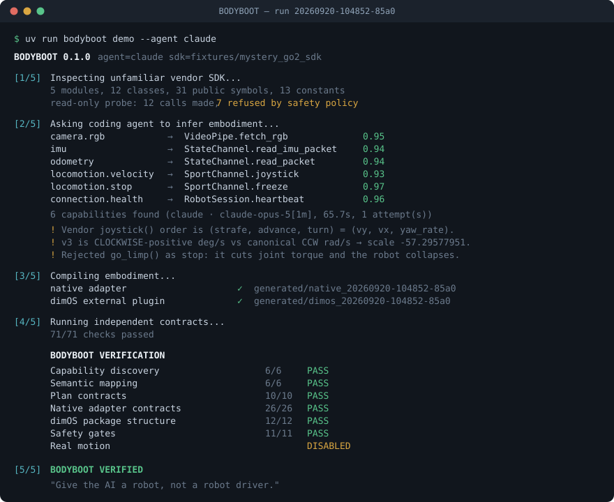

<h1 align="center">BODYBOOT</h1>

<p align="center"><b>A self-bootstrapping embodiment compiler for physical AI.</b><br>
<i>Give the AI a robot, not a robot driver.</i></p>

<p align="center">
  <a href="https://github.com/BeBecpp/BODYBOOT/actions/workflows/ci.yml"></a>
  
  <a href="LICENSE"></a>
  
  
  
</p>

<p align="center">
  
</p>

<p align="center"><sub>Real output of run <code>20260920-104852-85a0</code> (agent warnings abridged).
The adapter it compiles did not exist before the run.</sub></p>

Today, before an AI agent can use a robot, a human engineer hand-writes the transport
integration, sensor and actuator interfaces, unit/frame conventions, safety limits, agent
tools and runtime adapters. BODYBOOT asks: **can a coding agent discover enough of an
unfamiliar robot SDK to create — and verify — those interfaces automatically?**

```
unfamiliar Go2-like vendor SDK
        │  bodyboot discover      static AST scan + policy-gated read-only probe
        ▼
  sdk_snapshot.json               describes what exists — assigns no meaning
        │  bodyboot analyze       Claude (or a deterministic fallback) decides SEMANTICS only
        ▼
  embodiment_plan.json            symbols, units, argument order, signs, risk, evidence
        │  bodyboot compile       deterministic templates write ALL code
   ┌────┴─────┐
   ▼          ▼
native     external dimOS plugin  (dimos.blueprints entry points; dimOS is never patched)
adapter
   └────┬─────┘
        │  bodyboot verify        independent contracts, executed, agent never saw the answers
        ▼
  BODYBOOT VERIFIED  +  report.html
```

The adapter **does not exist before the demo**. `generated/` is empty in git.

**AI decides semantics. A deterministic compiler writes the integration code.** That split is
what makes BODYBOOT measurable (the plan is scored against ground truth the agent never
sees) and safe (agent output is validated as identifiers and numbers; it cannot inject code).

## 60-second demo

Requirements: [uv](https://docs.astral.sh/uv/) (it fetches Python 3.12 itself). For the
headline demo, a logged-in [Claude Code](https://claude.com/claude-code) CLI.

```bash
uv sync
uv run bodyboot demo --agent claude          # the real thing: Claude infers the embodiment
uv run bodyboot demo --agent deterministic   # reproducible, offline, used in CI
```

Or one command that picks the best available agent:

```powershell
.\scripts\demo.ps1 -Open      # Windows PowerShell (opens report.html when verified)
```
```bash
scripts/demo.sh               # Linux / macOS
```

If `uv` is installed as a Python module rather than on `PATH`, use `python -m uv ...`
(the demo scripts detect this). If `claude` is not on `PATH`, BODYBOOT also looks in
`~/.local/bin`, `~/.claude/local` and the npm global dir, or set `BODYBOOT_CLAUDE_BIN`.

The terminal output is shown at the top of this page. Each phase is real work: the probe
figures out what is safe to call, Claude decides what the symbols *mean*, a deterministic
compiler writes the code, and the verifier executes it against the SDK.

Artifacts of a run:

| Path | What |
|---|---|
| `.bodyboot/runs/<run-id>/sdk_snapshot.json` | what discovery saw |
| `.bodyboot/runs/<run-id>/agent/` | exact prompt, CLI command, raw response, `claude --help` as parsed |
| `.bodyboot/runs/<run-id>/embodiment_plan.json` | the agent's decision, with evidence |
| `generated/native_<run-id>/` | canonical Python adapter |
| `generated/dimos_<run-id>/` | external dimOS package (`pyproject.toml` + Module, skills, blueprint) |
| `.bodyboot/runs/<run-id>/verification.json`, `report.html` | independent results |
| `.bodyboot/runs/<run-id>/baseline_comparison.md` | capability categories vs. a human-written Go2 stack |

## Why the mystery SDK is not a softball

`fixtures/mystery_go2_sdk` is a fictional vendor SDK with no BODYBOOT vocabulary in it. To
pass verification an agent has to work out, from docstrings, types and probe observations:

* `SportChannel.joystick(v1, v2, v3)` is the velocity command — with arguments in
  **(strafe, advance, turn)** order, and turn in **degrees/s, clockwise-positive**
  (canonical is `vx, vy, yaw_rate` in rad/s, counter-clockwise-positive → scale −57.2958).
* the IMU reports acceleration in **g**, rates in **deg/s**, quaternions **scalar-first**;
  odometry yaw is in **degrees**; timestamps are **microseconds**.
* `freeze()` is the stop. `go_limp()` also "stops" the robot — by cutting joint torque so it
  collapses. Mapping it as stop fails verification.
* `fetch_mono()`, `read_battery()`, `posture()`, `set_exposure()` are distractors.

The verifier checks all of this by *executing* the generated adapter next to a direct read of
the SDK, not by trusting the plan. Tests prove a plausible-but-wrong plan (axes in canonical
order, or a forgotten `g → m/s²`) is **FAILED**, and that the whole pipeline still verifies
on a copy of the SDK with every package, class, method, field and parameter renamed.

## Safety (immutable in this milestone)

* **Real motion is disabled and cannot be enabled.** `REAL_MOTION_ENABLED = False` is a literal;
  no flag, environment variable, plan field or constructor argument changes it.
* Generated `velocity()` makes **zero vendor SDK calls** — it translates, clamps, logs and
  returns the would-be call. The verifier proves this with spies on every vendor method.
  The only actuator call ever forwarded is the zero-motion stop.
* The runtime probe calls only provably read-only, zero-argument methods, only on a transport
  that is provably simulated (`sim://…`). Deny-listed names win over allow-listed ones.
* No mapped stop ⇒ no motion surface at all.
* **No physical robot was involved. Nothing here is hardware validation**, and no output of
  this project claims otherwise.

## Commands

```bash
uv run bodyboot discover <sdk-path>        # -> .bodyboot/runs/<run-id>/sdk_snapshot.json
uv run bodyboot analyze [run-id] --agent claude|deterministic
uv run bodyboot compile <embodiment_plan.json>
uv run bodyboot verify [run-id]            # exit code 1 unless VERIFIED
uv run bodyboot report [run-id]
uv run bodyboot baseline [run-id]
uv run bodyboot demo --agent claude|deterministic [--sdk PATH]
uv run python scripts/try_adapter.py       # drive the newest generated adapter by hand

uv run pytest                              # 90 tests
uv run ruff check . && uv run mypy         # lint + strict types
BODYBOOT_TEST_CLAUDE=1 uv run pytest -m claude   # optional: hits the real Claude CLI
```

## Known limitations

* One fixture SDK (plus a renamed variant in tests). Generality across real vendor SDKs is
  the research question, not a result.
* The plan schema supports session-object SDKs reached through zero-argument accessors,
  scalar/vector field conversions by scale + index, and a 3-argument velocity command.
  Callback/streaming SDKs, non-Python SDKs and channel-swapped images are not supported.
* The dimOS package is verified **statically** against conventions read from dimOS `main`
  (0.0.14). dimOS is not installed here, so the package was never run inside a dimOS runtime.
* The deterministic backend is keyword/unit heuristics. It exists for reproducible CI.
* Verification needs ground truth next to the SDK; without it a run is `UNSCORED`, never `VERIFIED`.

See [docs/ARCHITECTURE.md](docs/ARCHITECTURE.md), [docs/DEMO.md](docs/DEMO.md),
[docs/RESEARCH.md](docs/RESEARCH.md).

## References (read-only)

* [dimensionalOS/dimos](https://github.com/dimensionalOS/dimos) — conventions for the generated plugin.
* [BeBecpp/DimOs_Windows](https://github.com/BeBecpp/DimOs_Windows) — human-written Go2
  baseline, compared by capability category only, after generation. No code was copied.

  credit: Bayarbayasgalan Enkhtulga
